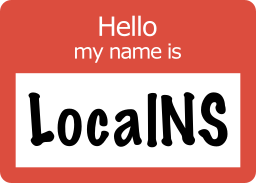

# localns

<p align="center" width="100%">
  
</p>

[](https://localns.readthedocs.io/en/latest/?badge=latest)

This is a DNS server running in a docker container that serves DNS records
generated from a number of sources optionally with upstream servers serving
anything unknown. It support split-horizon DNS so that local IPs can be served
for local servers when the public authoratative nameserver serves a different
IP.

I am building this to solve some complexity I am facing on my local network
where I want DNS served for various local docker containers and other services.

With no configuration the server will serve nothing. You must add sources of DNS
records and optionally an upstream for everything else. A number of sources will
be supported starting with docker containers, traefik instances and dnsmasq
lease files. Others should be straightforward to add.

## Configuration

Configuration is done via a yaml file located at `/etc/localns/config.yaml`:

```yaml
sources:
  docker:
    local: {}

zones:
  myzone.local:
    upstream: 10.10.10.254
  myotherzone.local:
    authoritative: false

defaults:
  upstream: 1.1.1.1
```

The sources key lists the different sources of records, see below for more
details.

The zones key allows for marking zones as authoratative and for providing
upstream DNS servers for finding records not known locally. The server will
claim authority over any zones listed (unless disabled).

The default upstream is the default for any requests where a zone hasn't
specified its own upstream.

## Sources

Each source type allows for listing a number of sources with a name (mainly
used for logging) and a configuration.

### docker

Serves records based on docker containers. Once connected to a docker server
it watches for containers to start and stop. Any containers with the label
`localns.hostname` have a DNS record generated.

### traefik

Connects to a [Traefik](https://doc.traefik.io/traefik/) instance and creates
host records for all of the known http services.

### dhcp

Attempts to read hosts from a dhcp lease file (currently dnsmasq format is
supported).

### file

Reads DNS records from a yaml file.

### remote

Reads DNS records from a remote instance of localns.
